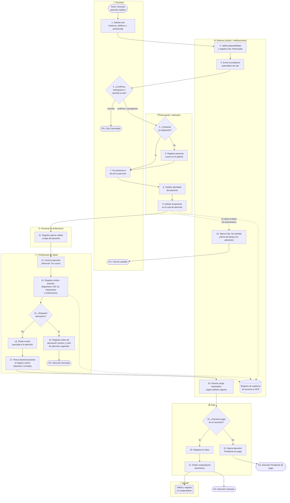

> [🏠 Home](../../README.md) › 2. Especificación del Proceso de Negocio › [2.1. Diagrama del Proceso (TO-BE)](2.1.md)

# 2.1. Diagrama del Proceso (TO-BE)

## Descripción general

El diagrama representa el modelo **TO-BE** del proceso _"Gestión de la atención ambulatoria en consultorios y clínicas privadas"_, es decir, el proceso tal como debe funcionar una vez implementada la plataforma SaaS multi-tenant descrita en la sección [1.1](../1.1/1.1.md).

Se modela como diagrama de flujo con **carriles (lanes)** por actor, equivalente en propósito a un diagrama BPMN por pools/lanes: cada columna agrupa las actividades bajo la responsabilidad de un actor definido en [1.2. Lista de Actores y Roles](../1.2/1.2.md), y las transiciones entre carriles representan el traspaso de información o de control entre actores.

Los estados de cita y de atención que aparecen en el diagrama corresponden exactamente a los definidos en [1.3. Lista de Reglas de Negocio](../1.3/1.3.md).

---

## Diagrama (TO-BE)

---

## Convenciones del diagrama

| Elemento                                  | Significado                                                                                        |
| ----------------------------------------- | -------------------------------------------------------------------------------------------------- |
| Rectángulo                                | Actividad / tarea realizada por el actor del carril                                                |
| Rombo                                     | Punto de decisión                                                                                  |
| Óvalo                                     | Evento de inicio o de fin del proceso                                                              |
| Forma de documento (doble línea inferior) | Interacción con un sistema externo (SUNAT)                                                         |
| Cilindro                                  | Almacén de datos (registro de auditoría)                                                           |
| Flecha continua                           | Flujo principal de secuencia (control)                                                             |
| Flecha punteada                           | Flujo de información / evento asíncrono (recordatorio, registro de auditoría, expiración de plazo) |

## Notas sobre el modelo TO-BE

- El diagrama no incluye el modelo AS-IS (gestión en papel y hojas de cálculo descrita en [1.4.1](../1.4/1.4.md)) porque el objetivo del proyecto es especificar el sistema propuesto; el AS-IS ya quedó caracterizado como problema en esa sección.
- Las actividades 15 (derivación) y 16 (receta) son condicionales al caso clínico y mutuamente excluyentes respecto a la ruta de derivación: si el profesional deriva al paciente (actividad 15), el proceso termina ahí y no se ejecutan la receta ni la firma; si no deriva, se ejecutan en secuencia 16 (receta, solo si aplica) y 17 (firma electrónica, que sí ocurre siempre que no hay derivación).
- El registro de auditoría (carril Sistema) se activa en paralelo cada vez que se accede o modifica la historia clínica, conforme a la Regla General N.° 3 de [1.3](../1.3/1.3.md); por eso se representa con flechas punteadas hacia un almacén de datos en vez de como un paso secuencial del flujo principal.
- Los cuatro finales posibles del proceso (Cancelada, No asistida, Derivada, Cobrada / Pendiente de pago) corresponden a los puntos de fin descritos en el alcance del proceso ([1.1](../1.1/1.1.md)).

---

[⬅️ Anterior](../1.4/1.4.md) | [🏠 Home](../../README.md) | [Siguiente ➡️](../2.2/2.2.md)
